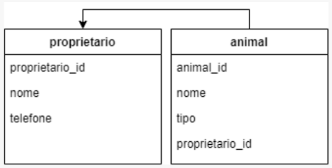

# Pet Shop API 🐾🏪
Aplicação de estudos com a finalidade de simular uma API de um Pet Shop.

## 💻 Tecnologias utilizadas:
* 📜 JavaScript
* 🌐 Express
* 🔄 Nodemon
* 🔀 Cors
* 🔑 Dotenv
* 🐘 Pg
* 🐘 ElephantSQL

## 🐱 Sobre o projeto

## 👀 Observações
* O arquivo ```.env.example``` deve ser renomeado para ```.env``` e preenchido corretamente com a string de conexão.
* Para iniciar o projeto, execute o comando ```npm run dev```.

## 📊 Diagrama ER


## 🏁 Endpoints
### Donos:
* **localhost:3333/owners...**
  * ``/getowners``
  * ``/makeowners``
  * ``/updateowners``
  * ``/deleteowners/:owner_id``
  * ``/getOwnerbyid/:owner_id``
### Animais:
* **localhost:3333/animals...**
  * ``/getanimals``
  * ``/makeanimals``
  * ``/updateanimals``
  * ``/deleteanimals``
  * ``/getanimalsbyid/:animals_id``
  * ``/getanimalsbyowner/:owner_id``